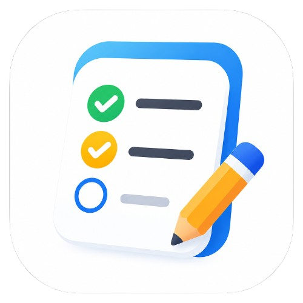
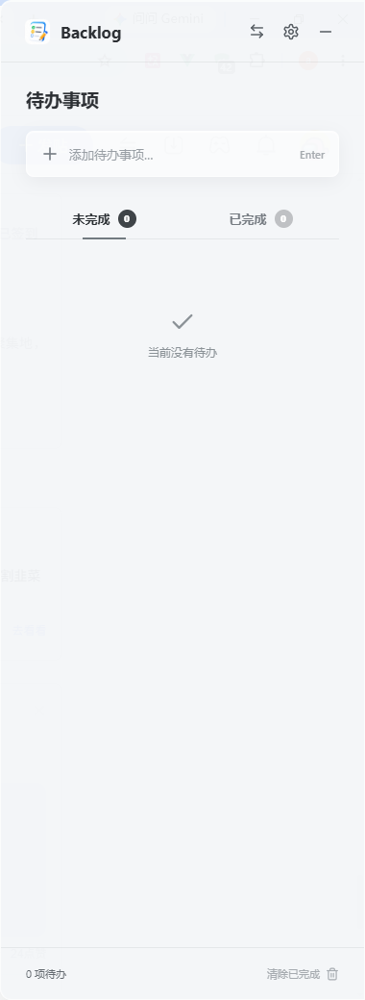

<div align="center">
  
  <h1>Backlog</h1>
  <p><strong>A local-first todo sidebar that stays one shortcut away.</strong></p>
  <p>A compact, always-on-top task companion for Windows. No accounts, no cloud, no distractions.</p>

  <p>
    <a href="https://github.com/AtEase00/backlog/releases/latest"></a>
    <a href="https://github.com/AtEase00/backlog/releases"></a>
    
    
  </p>

  <p><a href="README.zh-CN.md">简体中文</a></p>
</div>



## Why Backlog?

Most task managers ask you to open another full-sized app, create an account, or move your data into someone else's cloud. Backlog takes a smaller approach: it lives at the edge of your desktop, appears with a global shortcut, and keeps your tasks on your own device.

- **Local first** — your tasks are stored locally and work without an account.
- **Always within reach** — show or hide the sidebar from anywhere with a global shortcut.
- **Built for focus** — unfinished and completed tasks stay in separate views.
- **Desktop native** — system tray, edge docking, always-on-top behavior, and a compact glass interface.
- **Private by default** — no analytics, cloud sync, or remote account is required.

## Features

- Create, edit, complete, restore, and delete todos
- Separate **Unfinished** and **Completed** tabs
- Group tasks by local creation date
- Dock to the left or right edge of the current display
- Match the display work-area height while keeping the width adjustable
- Stay on top without taking space in the taskbar
- Show or hide the app from the system tray
- Record a custom global shortcut (`Ctrl/Cmd + Shift + /` by default)
- Follow the system language or choose Simplified Chinese / English
- Clear all completed tasks in one action
- Store all task data locally in SQLite
- Use native Acrylic on Windows and Vibrancy on macOS, with a readable translucent fallback

## Download

### Windows

Download the latest installer from [GitHub Releases](https://github.com/AtEase00/backlog/releases/latest).

The installer lets you choose the installation directory. Backlog is currently unsigned, so Windows SmartScreen may show a warning during installation.

### macOS

macOS support is in development. A signed and notarized installer is not available yet.

## Quick Start

1. Install and launch Backlog.
2. Add a task from the input at the top of the sidebar.
3. Use `Ctrl/Cmd + Shift + /` to hide or restore the window.
4. Click the tray icon to toggle the window, or right-click it for docking, settings, and quit actions.

The main window intentionally has no quit button. Backlog remains available from the system tray until you choose **Quit Backlog** from the tray menu.

## Privacy

Backlog is designed as a local-only application:

- No account is required
- No task content is uploaded
- No cloud service is contacted for task storage
- No telemetry or analytics is included

Your task database and preferences are stored in Electron's local application data directory on your device.

## Platform Status

| Platform | Status | Package |
| --- | --- | --- |
| Windows 10/11 | Available | NSIS installer |
| macOS | In development | DMG planned |

## Development

### Requirements

- Node.js 22.18 or newer
- pnpm 10 or newer

### Run locally

```bash
git clone https://github.com/AtEase00/backlog.git
cd backlog
pnpm install
pnpm dev
```

### Checks and packaging

```bash
pnpm typecheck
pnpm test
pnpm build
pnpm dist
```

Windows packages should be built on Windows. macOS signing and notarization will require a macOS build environment and an Apple Developer ID.

## Tech Stack

- Electron
- Vue 3 + TypeScript
- electron-vite
- SQLite via `node:sqlite`
- Lucide icons
- electron-builder
- Vitest

## Roadmap

- [ ] Markdown and rich-text notes
- [ ] Attachments
- [ ] SQLite FTS5 local search
- [ ] Import and export archives
- [ ] Automatic updates
- [ ] Signed and notarized macOS release

Roadmap items describe direction, not committed release dates.

## Contributing

Bug reports, design feedback, and focused pull requests are welcome. Please open an [issue](https://github.com/AtEase00/backlog/issues) before starting a large change so the scope can be aligned first.

If Backlog makes your desktop a little calmer, consider giving the project a star. It helps more people discover it.

